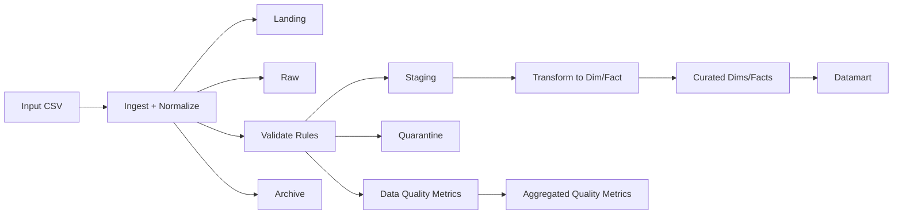
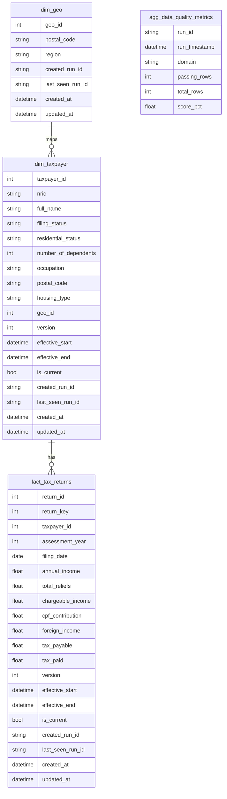

# GovTech Tax Data Pipeline

## Overview
This project provides a modular ETL pipeline to ingest, validate, and transform individual tax return data into analytics-ready tables and data quality metrics. The pipeline is designed to handle data quality issues and scale to larger volumes.

## Assumptions
- Input file path is input/individual_tax_returns.csv.
- Column names are normalized to snake case during ingestion.
- Assessment year is a 4-digit year and filing dates must be after the assessment year.
- NRIC validation uses a basic format check only.
- Incremental loading filters by assessment_year, tracking the last processed year in outputs/metadata/state.json.
- Multiple files for the same assessment year are supported via file tracking. It has been taken into account that there will be multiple input files for the same assessment year due to constraints that limit to a file only able to contain maximum 100k records.
- File tracking currently is based on filename + size + modified time. However, further improvements can be made such as using checksum for identification of changes in source file. (Detailed requirements of source file to be ingested will be required for more robust design logics to be well thought through)
- Curated tables use upsert/merge; `dim_taxpayer` and `fact_tax_returns` retain history via SCD2, while `dim_geo` is Type 1 (latest state only).

## How To Run
1. Install dependencies:
   - pip install -r requirements.txt
2. Run the pipeline:
   - python -m src.main --config configs/pipeline.yaml
3. Allow backfill for older years (without backfill option, pipeline will only expected to ingest where assessment_year is >= max(assessment_year) ingested into database):
    - python -m src.main --config configs/pipeline.yaml --allow-backfill

## Tests
- Validation unit tests are in tests/test_validation.py.
- Run all tests with: pytest
- Run only validation tests with: pytest tests/test_validation.py

## Docker
1. Build the image:
    - docker build -t govtech-tax-pipeline .
2. Run the container:
    - docker run --rm -v "${PWD}/data:/app/data" -v "${PWD}/outputs:/app/outputs" govtech-tax-pipeline
3. Override config path:
    - docker run --rm -e PIPELINE_CONFIG=configs/pipeline.yaml -v "${PWD}/data:/app/data" -v "${PWD}/outputs:/app/outputs" govtech-tax-pipeline

## Docker Compose
1. Build and run:
    - docker compose up --build
2. Stop:
    - docker compose down
3. Override config path:
    - PIPELINE_CONFIG=configs/pipeline.yaml docker compose up --build

## Outputs
- outputs/landing/Tax_source/YYYY/MM/DD/{run_id}/*.csv
- outputs/raw/Tax_source/ingest_date=YYYY-MM-DD/raw_{run_id}.parquet
- outputs/staging/Tax_source/ingest_date=YYYY-MM-DD/staging_{run_id}.parquet
- outputs/staging/quarantine/Tax_source/ingest_date=YYYY-MM-DD/quarantine_{run_id}.parquet
- outputs/staging/quarantine/Tax_source/ingest_date=YYYY-MM-DD/quarantine_breakdown_{run_id}.parquet
- outputs/staging/quarantine/Tax_source/ingest_date=YYYY-MM-DD/quarantine_samples_{run_id}.parquet
- outputs/curated/dim_geo.parquet
- outputs/curated/dim_taxpayer.parquet
- outputs/curated/fact_tax_returns.parquet
- outputs/curated/data_quality_results.parquet
- outputs/curated/agg_data_quality_metrics.parquet
- outputs/curated/summary_report.parquet
- outputs/datamart/datamart_tax_returns.parquet

## Archive
- archive/Tax_source/YYYY/MM/DD/{run_id}/*.csv
- outputs/metadata/state.json
- outputs/metadata/processed_files.csv

## Data Quality Rules
Domains and rules are classified as follows:
- Completeness: Rule 1 (NRIC format and presence)
- Validity: Rule 2 (Postal code format)
- Accuracy: Rules 3-5 (Filing date after assessment year, chargeable income formula, CPF residency requirement)

## Data Flow (Mermaid)

## Data Model (Mermaid)
Data model highlights:
- `dim_geo` is Type 1 and stores the latest region mapping per postal code.
- `dim_taxpayer` is SCD2 by `nric` with history tracked via `effective_start`, `effective_end`, and `is_current`.
- `fact_tax_returns` is SCD2 by `return_key` (nric + assessment_year) and retains historical changes.
- `datamart_tax_returns` joins `fact_tax_returns` with current `dim_taxpayer` and `dim_geo` for reporting.

## Architecture Diagram
- docs/azure_architecture.ppt
- docs/architecture.md

## Technical Documentation
- docs/technical_documentation.md
- docs/fabric_powerbi_setup.md

## Business Documentation
- docs/business_documentation.md

## Submission
- Include the full repository and keep the latest outputs in outputs/ for review.

